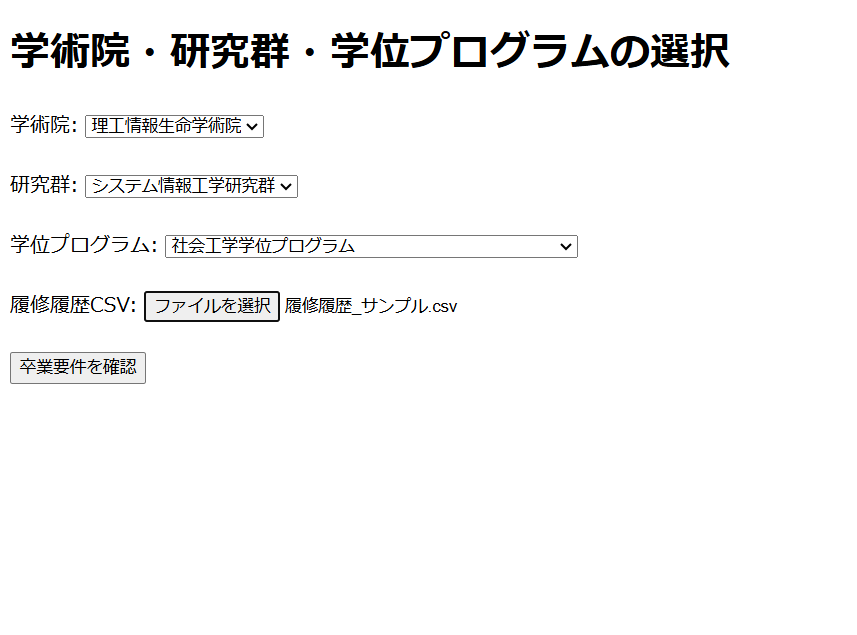
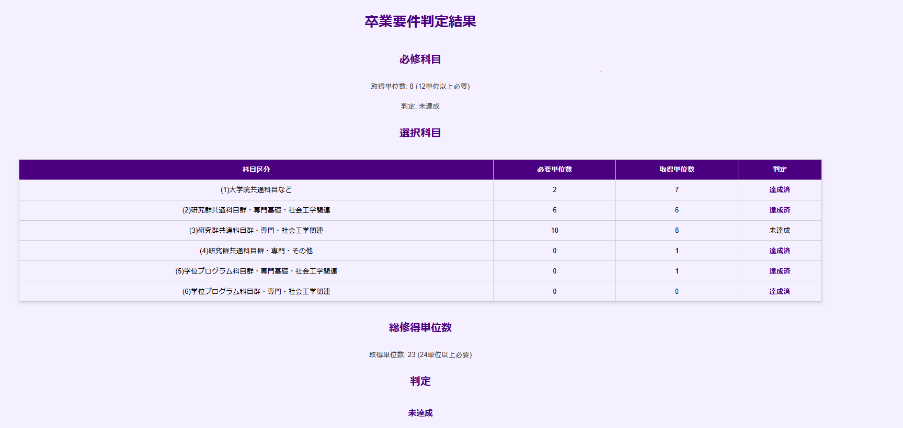

# 卒業要件の達成状況の確認アプリ

## 概要
所属を入力し、履修履歴CSVをアップロードすることで卒業要件の達成状況が分かります。

今回は、1人で要件定義、フロント・バックエンド・デプロイを行いました。

## 背景
現在大学から卒業要件の達成状況を確認できるアプリが提供されておらず、学生は自分で一つずつ履修した授業と科目区分を紐づけて確認するか、年度末に実施される対面の卒業判定に赴かなければならず、手間がかかっています。  
そのため、そのような手間を削減し、快適に卒業要件を満たせているか、また、満たすためには何が必要なのかを確認できるアプリを作成しました。

## 使用技術
PHP:8.2.14  
Laravel:10.48.22  
デプロイ：Heroku  

## URL
URL:https://graduation-checker-1536df13f004.herokuapp.com/

## 機能
- 卒業要件達成状況の確認  
  - 必修科目と選択科目の達成状況の表示 
  - 各科目区分ごとの詳細の表示

## 工夫点
- CSVファイルはデータベースには保存せず、メモリ上で処理後に削除
- 必要な列（科目コード、単位数、評価）のみを取得し、それ以外の個人情報を含む可能性のあるデータは無視
- 正規表現による柔軟な卒業要件条件の設定

## 苦労した点
- 卒業要件の多様な分類と条件設定
- 他の学術院でも使用できるような一般的な卒業要件フォーマットの作成

## 今後の展望
- 対象学術院の拡大
- 学期ごとの進捗の表示
- 履修中の科目も含めた予測結果の表示
- 単位が不足している科目区分の開設授業科目一覧へのリンク
- 大学院だけでなく大学にも対応させる

## ER図・ワイヤーフレームなど

